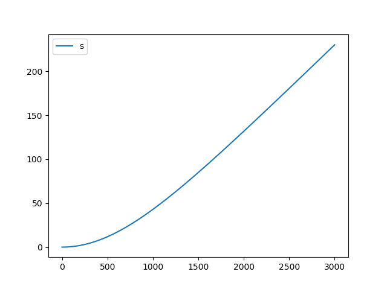

# Modeling with Python
This module enables you to quickly model physics and other subjects using basic building blocks. These are:
- `Variable`
- `Constant`
- `Stream`

The documentation for these objects is after the following example.

Let's consider the following example: Imagine a car which starts with a veolcity of zero and then gradually accelerates. While it accelerates, it burns fuel and it has an increased air resistance. Of course there are other factors, but this model would be implemented like this:
```python
from model import Model
from model import Variable as V
from model import Constant as C
from model import Stream as S

# Define model
model = Model("Car", dt=0.1, max_t=300) # 300 seconds of modeling

# Constants
Froll = C(unit="N", value=1000) # Roll resistance
k = C(value=0.1) # Air resistance coefficient
m_base = C(unit="kg", value=1000) # Base mass
rch = C(unit="J/kg", value=46e6) # Combustion energy density
Fm = C(unit="N", value=1050) # Motor force

# Variabless

s = V(unit="m") # Distance
v = V(unit="m/s") # Velocity
a = V(unit="m/s^2") # Acceleration
a.define("Fnetto/m")

Pm = V(unit="J/s")
Pm.define("Fnetto*v")

m_fuel = V(unit="kg", start=10) # Fuel mass

m = V(unit="kg", start=m_base.value + m_fuel.value)
m.define("m_base+m_fuel")

Flw = V(unit="N")
Flw.define("k*v**2")

Fnetto = V(unit="N") # Netto force
Fnetto.define("Fm-Froll-Flw")

# Connections
s < S("v*dt") # Distance increases with speed
v < S("a*dt") # Velocity increases with acceleration
m_fuel > S("Pm*dt/rch") # Fuel decreases with motor power

# Start model
model.add_scope(locals())
model.add_stop("m_fuel <= 0")
model.loop(True)

# Show results

model.plot("s")
model.show()
```
This model can be found in `Car.py`. It yields the following plot of the distance:



## Documentation
This module consists of: Model, Variable, Constant and Stream

### `Stream`
A `Stream` object changes a variable's value. It can be defined as follows:
```python
# Acceleration
# Stream(formula, name)
a = Stream("Fnetto/mass")
```

### `Variable`
A `Variable` object defines a value which can change over time. It can be initialised with a value, it defaults to zero. The `Variable` can be defined as a formula or as multiple streams acting upon it.

Defined it looks like:
```python
# Variable(name, unit, start)
x = Variable(unit="m", start=10)
x.define("v*t") # Distance is velocity times time passed.
```

With streams:
```python
x = Variable(unit="m") # Start distance at zero is implicit.
# The distance changes with the current velocity
x < Stream("v*dt") # The "<" operator acts like a stream 'into' the variable, so it increases the distance on every tick.
x > Stream("v*dt") # The ">" operator acts like a stream 'out' of the variable, so it decreases the distance on every tick. 
```

### `Constant`
A `Constant` object defines a value that is constant throughout the model. It can be used like:
```python
# Constant(name, unit, value)
mass = Constant(unit="kg", value=10)
```

### `Model`
The `Model` object combines all building blocks and starts the modeling. It can either run the simulation until a stop condition is met, or when the maximum time is reached. Only `Variable`s and `Constant`s can be added, since `Stream`s are part of the `Variable` object. The added object can define its name as an extra argument, or the name can be extracted from the local scope, using the `locals()` function in Python.

An example of a ball falling, looks like:
```python
# Model(name, max_t=1000, dt=0.1, infinite=False)
m = Model("Falling Ball", max_t=60)
mass = Constant(unit="kg", value="1")
Fz = Variable(unit="N")
Fz.define("mass*9.8")
a = Variable(unit="m/s^2")
a.define("Fz/mass")
v = Variable(unit="m/s")
v < Stream("a*dt")
s = Variable(unit="m")
s < Stream("v*dt")

# Add the Variables and Constants to the model:
m.add_scope(locals())
# Alternatively:
m.add_vars(mass, Fz, a, v, s)

# Stop condition
m.add_stop("v >= 10") # Stop de simulation if the velocity exceeds 10 m/s

# Start modeling:
m.loop(True) # True, means: enable backtracking. So intermediate values are stored for plotting and review.

# Optionally plot the results
# The module uses the standard pyplot interface of matplotlib for plotting
# The values can be extracted with: m.save["the variable"], it yields a standard Python list
m.plot("s")
m.show()
```